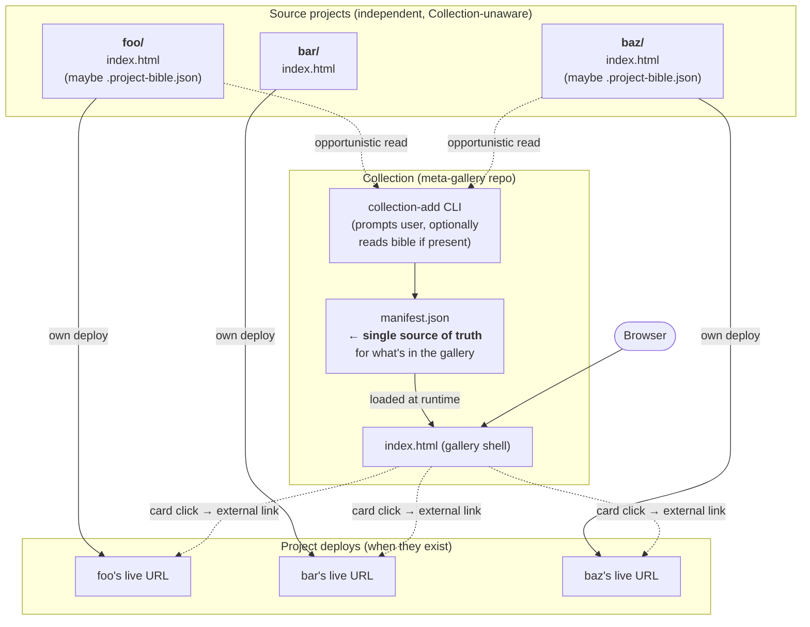

# Collection — Architecture

The proposed shape for how Collection participates in your wider project graph.
Not yet fully implemented; today's repo is a transitional snapshot (see
"Migration path" below).

## The contract

For a project to appear in Collection:

1. It needs to be reachable (git repo on GitHub with its own Pages, OR a
   folder on disk that gets cloned into Collection's repo).
2. It needs an entry HTML — eventually `index.html` at root, but during
   transition the manifest can point at any specific file.

That's it. **The project itself doesn't need any Collection-specific files.**
All metadata about how a project appears in the gallery lives in
**Collection's** `manifest.json`, not in the project.

If a project happens to have a `.project-bible.json`, `collection-add` reads
it opportunistically as input — but Collection never depends on the bible
schema. (Schema is under review; binding to it would be a tight coupling.)

## Diagram



## ASCII version (for terminals or when mermaid won't render)

```
   ┌──────────────────────────┐  ┌──────────────────────────┐
   │  ~/Projects/foo/         │  │  ~/Projects/bar/         │
   │   ├─ index.html          │  │   └─ index.html          │
   │   └─ (maybe bible.json)  │  │                          │
   └────────────┬─────────────┘  └────────────┬─────────────┘
                │                              │
       (deploys itself)                (deploys itself)
                │                              │
                ▼                              ▼
       ┌─────────────────┐           ┌─────────────────┐
       │ foo's GH Pages  │           │ bar's GH Pages  │
       └────────┬────────┘           └────────┬────────┘

                       ┌────────────────────────┐
                       │   collection-add CLI   │
       (opportunistic) │  prompts user; optional│
       bible read ─────┤  best-effort bible read│
                       └───────────┬────────────┘
                                   │ writes entry
                                   ▼
                           ┌────────────────┐
                           │ manifest.json  │ ← per-import data lives HERE,
                           └───────┬────────┘   not in the project
                                   │ loaded at runtime
                                   ▼
                      ┌──────────────────────────┐
                      │  Collection gallery shell│
                      │  halapenyoharry.github   │
                      │  .io/collection          │
                      └────────────┬─────────────┘
                                   │ card links out
                  ┌────────────────┼────────────────┐
                  ▼                ▼                ▼
            foo's Pages       bar's Pages       baz's Pages
```

## Roles & boundaries

| Thing | Owns | Does NOT own |
|---|---|---|
| Source project | Entry HTML, presentation, dependencies, its own deploy | Anything Collection-related |
| Collection / `manifest.json` | Title, description, tags, URL — all per-import data | Project content |
| `collection-add` | Prompting user, writing manifest entries, *optionally* reading bibles | Editing source projects |

## Data flow when adding a project

1. Run `collection-add <path-or-url>` (e.g. `~/Projects/foo` or
   `https://github.com/halapenyoharry/foo`).
2. Tool checks if a `.project-bible.json` is present. If yes, pre-fill
   answers from it (best-effort, schema-tolerant: pull whichever fields
   it recognizes, ignore the rest).
3. Tool prompts user for any missing fields — title, description, tags,
   live URL. (Optionally: `--auto` mode pre-fills via gemini reading
   the repo first.)
4. Tool appends an entry to Collection's `manifest.json`.
5. User commits + pushes. Pages rebuilds. Card appears.

The source project is never touched.

## What Collection NEVER does

- Edit the project's HTML.
- Rename project files.
- Inject nav bars, back links, or attributes into project HTML.
- Require any specific file inside the project (besides an entry HTML).
- Bind to a specific bible schema.

## Migration path (where we are now)

**Current state (transitional):** Collection's `experiences/` folder holds
copies of 5 borrowed projects, with CDN URLs rewritten to a shared
`_vendor/`. The originals live untouched in `~/Projects/`. The manifest
points at relative paths inside `experiences/`.

**Target state:** Each of those 5 source projects has its own deploy.
Collection's manifest points at absolute external URLs.
The `experiences/<slug>/` copies and `_vendor/` go away. Collection's
repo shrinks to: `index.html`, `manifest.json`, `ARCHITECTURE.md`,
and a small `collection-add` script.

**In-between:** A manifest entry's `path` field accepts both shapes —
relative path (legacy copy) or absolute URL (link-out). Projects
migrate one at a time.

## Why this shape

- **Zero project pollution.** Source projects don't know Collection
  exists. Add or remove a project by editing only Collection's repo.
- **No schema lock-in.** Bibles are an input, not a contract. If the
  bible schema changes, we update the reader; nothing in projects
  needs to change.
- **One source of truth per project.** Edit foo in foo's repo. No
  copies drifting.
- **Projects iterate independently.** A change to foo redeploys foo's
  Pages immediately; Collection auto-reflects.
- **Failure modes are local.** A broken project breaks its own deploy,
  not the gallery.
- **Reversible.** Removing a project = deleting one manifest entry.
